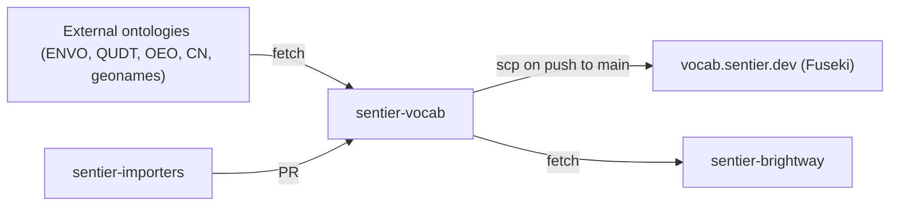
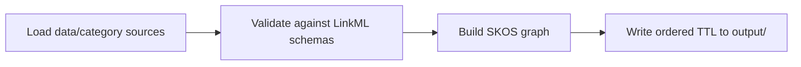

# sentier-vocab



## What it is

- One canonical IRI per term under `https://vocab.sentier.dev/`: flows, units, products, processes, LCIA methods, impact categories, and more.
- `app/sentier_vocab/iris.py` is the registry of published namespaces. They never change without a migration.
- LinkML schemas in `schemas/` define each term type. A generator validates `data/` against them and writes TTL to `output/`.
- Bulk terms arrive as Parquet through `sentier-importers` pull requests, not by hand.

## Install

Not on PyPI. Clone, then sync:

```bash
git clone https://github.com/sentier-dev/sentier-vocab.git
```

```bash
uv sync
```

## Use



Validate every `data/<category>/` source and write `output/*.ttl` (`--output-dir DIR` writes elsewhere):

```bash
uv run python -m sentier_vocab generate
```

Regenerate the coverage matrix `docs/COVERAGE.md`. `uv run sentier-vocab <command>` is the same CLI:

```bash
uv run python -m sentier_vocab coverage
```

Fetch the external ontologies and run the transitional importers. They write `app/sentier_vocab/importers/output/*.ttl`, which `generation-test.yml` copies to the triplestore on push to `main`:

```bash
uv run bash scripts/generate.sh
```

## Layout

| Path | Holds |
|---|---|
| `app/sentier_vocab/` | Package. `iris.py` namespaces, `generate.py`, `coverage.py`, `__main__.py` CLI, `importers/` with its own `output/`. |
| `data/<category>/` | Curated terms. YAML plus content-named Parquet for bulk imports. 13 categories. |
| `schemas/` | LinkML, one per term type, shared blocks in `common.yaml`. `_generated/` Pydantic is a build artifact. |
| `output/` | Generated TTL. `<category>.ttl` is committed. `<category>.<stem>.ttl` is gitignored. |
| `.github/workflows/` | `ci.yml` PR gate, `generation-test.yml` importer TTL deploy, `python-test.yml`, `python-package-deploy.yml`. |

## Data

- Every `*.yaml` and `*.parquet` file in `data/<category>/` is a source. Each source declares a `scheme`, and it must be registered in `iris.py`.
- Source stems `core` and `water` emit the committed `<category>.ttl`. Any other stem emits `<category>.<stem>.ttl`, which is gitignored.
- Bulk Parquet is named by content (per sector, per compartment) and stays under 3 MB (`check-added-large-files --maxkb=3000`). Shard with a `-NN` suffix, never git-LFS.
- Regenerate `output/` and `docs/COVERAGE.md` in the same PR as any `data/` or `schemas/` change. CI fails otherwise.

## Contributing

Format, then test:

```bash
uv run --extra dev pre-commit run --all-files
```

```bash
uv run --extra testing pytest
```

- See [CONTRIBUTING.md](CONTRIBUTING.md) and file bugs on the [issue tracker](https://github.com/sentier-dev/sentier-vocab/issues).
- Docs are Sphinx. The conda env is `docs/environment.yaml` (`sphinx_svd`); build with `sphinx-build docs _build/html`.

## License

Distributed under the terms of the [MIT license][License],
_svd_ is free and open source software.

[License]: LICENSE
